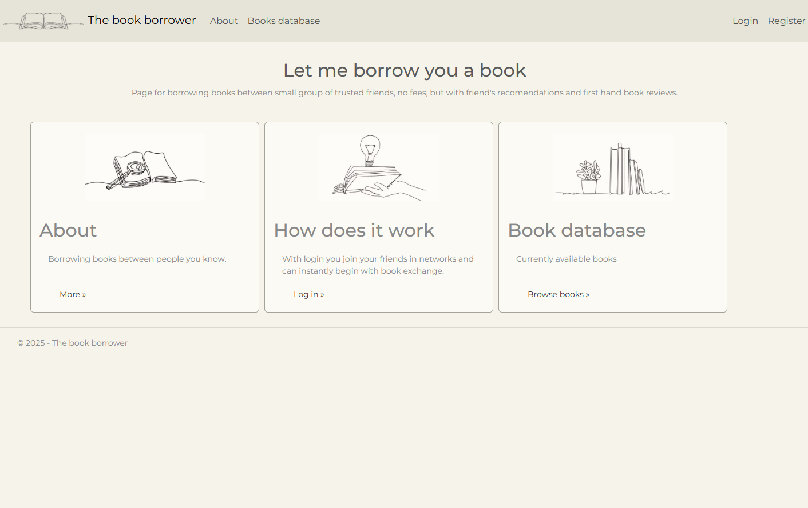
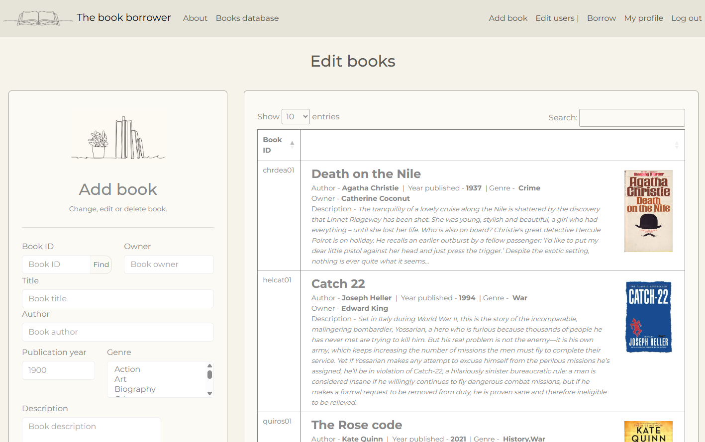
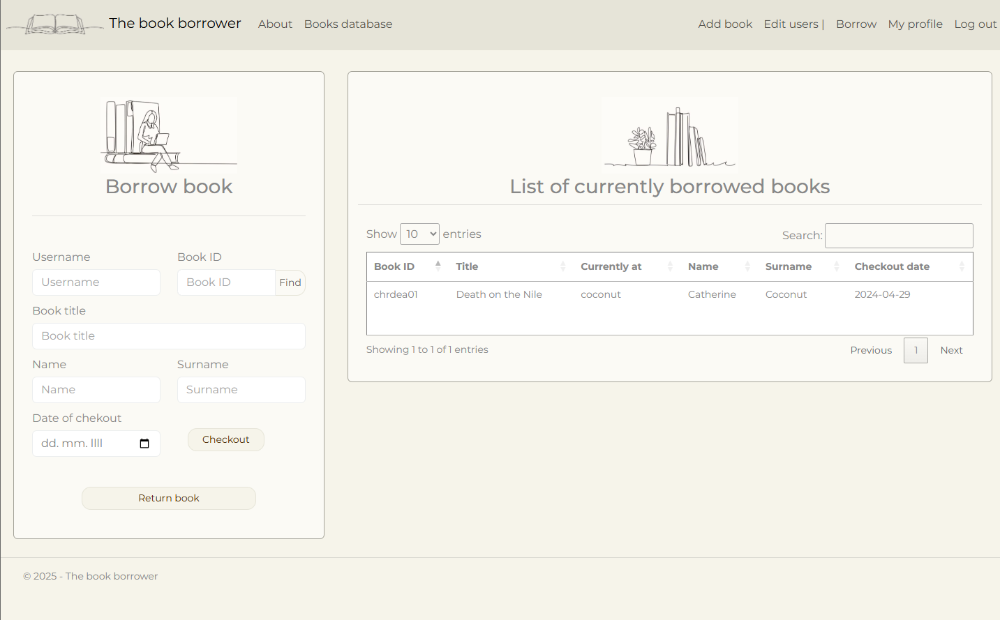
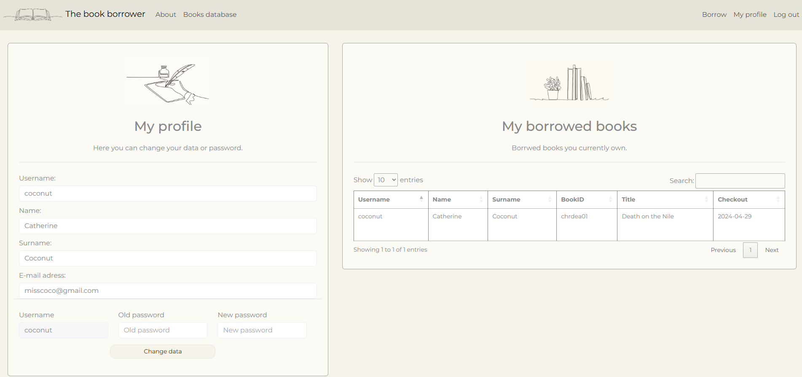

# 📚 The Book borrower (Library management system) 

A full-stack web application for managing book borrowing and user exchanges in a small community, built as a portfolio project using ASP.NET Web Forms and SQL Server.


## 📌 Project description
This application allows users to manage book borrowing within a small community. They can share books, borrow from others, and track exchanges — similar to a simplified library system.


## 🛠️ Tech stack
- ASP.NET Web Forms, C#
- SQL Server
- HTML, CSS, JavaScript


## 🚀 Features
- User registration and login
- Add, edit and delete books (admin)
- Browse available books
- Borrow and return books
- Track currently borrowed books
- User profile management

## 🧭 How it works

### 📚 Books
Users can add their own books to the shared database. Each book includes:
- Title and author
- Owner information
- Optional details (year, description, image)

### 🔄 Borrowing system
- Users can borrow books by selecting:
  - Book ID
  - Owner username
  - Date
- Borrowed books are displayed in a shared list
- Returning a book follows the same process

### 👤 User profile
- Users can edit their personal data
- View which of their books are currently borrowed

### 🛠 Admin role
Administrator can:
- Add, edit and delete books
- Manage users


## 📷 Screenshots
📌 These screenshots show the main functionality of the application.

### 📚 App overview


### ➕ Add book


### 🔄 Borrow system


### 👤 User profile



## 📚 What I learned
- Designing and working with relational databases (SQL)
- Implementing business logic for real-world scenarios
- Handling user interactions in ASP.NET Web Forms
- Managing data flow between UI and database


## ⚠️ Known limitations
- Usernames of other users are required for borrowing but not easily discoverable (list of usernames is only available to  admin)
- Book and user data visibility is not restricted to logged-in users
- Limited user insight into borrowed items (the user only sees books borrowed from them, but not books they have borrowed from others)


## 🔮 Future improvements
- Improve user visibility and privacy 
- Enhance borrowing workflow and UX
- Add better tracking of borrowed books
- Modernize the application architecture (e.g. API-based backend)


## ▶️ Running locally

1. Clone or download the repository.

2. Open the solution `Izposoja.sln` in Visual Studio.

3. Configure the database:
   - Open **Server Explorer** → Add Connection  
   - Select **Microsoft SQL Server Database File (SqlClient)** 
   - Choose Microsoft **SqlClient Data Provider**
   - Locate and connect to the `Library.mdf` file  
   - From database properties copy the generated **connection string** (Data Source=...)

4. Update the connection string in `Web.config` in Solution Explorer:
``` r
<connectionStrings>
  <add name="dbcon"
       connectionString="Data Source=(LocalDB)\MSSQLLocalDB;AttachDbFilename=YOUR_CONNECTION_STRING_HERE;Integrated Security=True;Connect Timeout=30"
       providerName="Microsoft.Data.SqlClient" />
</connectionStrings>
``` 


## 🔐 Login credentials

### Admin
- Username: admin  
- Password: admin  

### Users
- coconut / cococatherine  
- thebuilder / letsbuild0  
- king / longlivetheking1  
